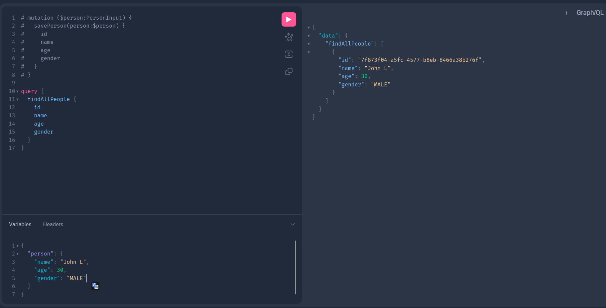

# GraphQL API

## About

An API developed using Spring Boot and GraphQL. It was developed for study purposes in GraphQL, a data query language. The project also used numerous Spring Boot and Java tools, and the H2 memory bank for ease of running the project, SOLID was also applied.

## Screenshot

## Requirements

1. [Docker](https://docs.docker.com/engine/install/)
2. [Docker-compose](https://docs.docker.com/compose/)

### Optional dependencies

1. [Java 17+](https://www.oracle.com/br/java/technologies/downloads/)
2. [Maven 3.6.2+](https://maven.apache.org/download.cgi)

## Get Started

### Running with docker-compose

1. Clone the repository or download the source code

        git clone https://github.com/WeversonL/graphql-api.git
        cd graphql-api

2. Start with docker-compose

        docker-compose up -d

3. Access the GraphQL command tab in your browser

        http://localhost:8080/graphiql

### Running with docker

1. Docker run

        docker run -p 8080:8080 --name gql-project weversonlemos/graphql-project:latest

2. Access the GraphQL command tab in your browser

        http://localhost:8080/graphiql

### Running with maven

1. Clone the repository or download the source code

        git clone https://github.com/WeversonL/graphql-api.git
        cd graphql-api

2. Download dependencies

        mvn clean install

3. Run application

        mvn spring-boot:run

### Possible commands to run

1. At the moment, the GraphQL Playground is not implemented, so to know what operations are performed, consult the file:

        src/main/resources/graphql/schema.graphqls

### Other information

1. To terminate the containers, you can run

        docker-compose down

2. You can directly access the in-memory database by following the url below

        http://localhost:8080/h2-console

### Future features

- As highlighted in one of the previous topics, the GraphQL Playground will be implemented, for an easier understanding of the API and possible operations

⚠️ Still in development

## License

`graphql-api` is released under the [GNU General Public License, Version 2](LICENSE)

        Copyright (C) 2022 Weverson Lemos

        This program is free software; you can redistribute it and/or
        modify it under the terms of the GNU General Public License
        as published by the Free Software Foundation; either version 2
        of the License, or (at your option) any later version
